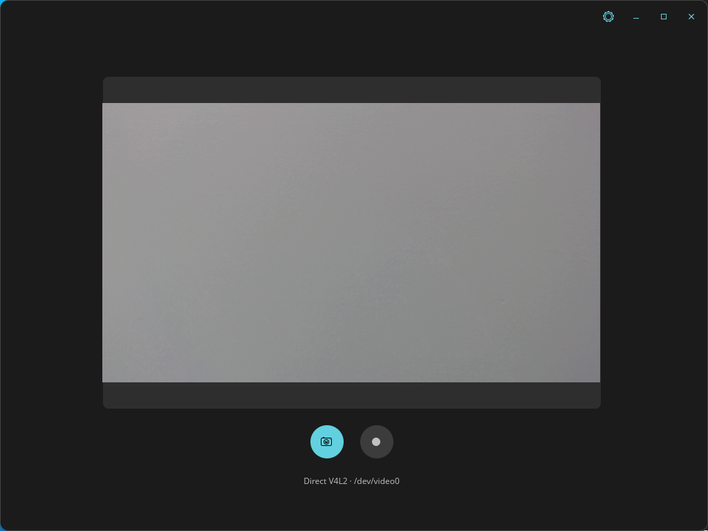
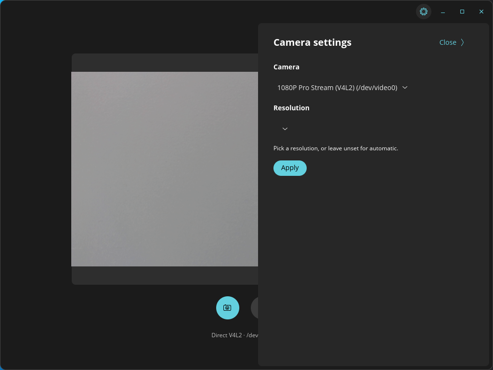

# Cosmic Camera

A distro-agnostic, Wayland-native camera app for [COSMIC](https://github.com/pop-os/cosmic-epoch) (System76's Rust desktop).

## Why

COSMIC doesn't ship a default camera app, and most third-party options are deprecated, unmaintained, or don't work properly on Wayland. Cosmic Camera takes the *correct* Wayland-native approach — capturing through the `org.freedesktop.portal.Camera` portal and PipeWire — with an automatic fallback to direct V4L2 access if the portal misbehaves, so it stays usable even on immature portal implementations.

## Features

- Live camera preview
- Camera and resolution selection (settings drawer, gear icon in the header): pick any camera the system exposes and any resolution/framerate it advertises
- Photo capture (JPEG) to `XDG_PICTURES_DIR` — saved at the selected full resolution, even though the on-screen preview is downscaled for smoothness
- Video recording (VP8/WebM — royalty-free, ships everywhere, no non-free codec packages needed) to `XDG_VIDEOS_DIR`
- Portal-first capture (sandboxable, Flatpak-friendly), with an automatic direct-V4L2 fallback if the portal fails or is unavailable
- Packaged as a Flatpak: the same build works on Debian, Fedora, Arch, and anywhere else Flatpak runs

## Screenshots

| Live preview | Settings drawer |
| :---: | :---: |
|  |  |

## Install

1. Make sure the [Flathub](https://flatpak.org/setup/) remote is configured (it supplies the runtime dependencies):
   ```bash
   flatpak remote-add --if-not-exists flathub https://flathub.org/repo/flathub.flatpakrepo
   ```
2. Download the latest `.flatpak` bundle from the [Releases page](https://github.com/rclinux/cosmic-camera/releases) and install it:
   ```bash
   flatpak install --user cosmic-camera-0.2.0-x86_64.flatpak
   flatpak run io.github.rclinux.CosmicCamera
   ```

## Building from source

Requires Rust, GStreamer + PipeWire development headers, and `pkg-config`. On Debian/Ubuntu/Pop!_OS:

```bash
sudo apt install cargo rustc pkg-config libgstreamer1.0-dev \
  libgstreamer-plugins-base1.0-dev libpipewire-0.3-dev gstreamer1.0-pipewire
cargo build --release
```

### Building the Flatpak yourself

```bash
# Regenerate vendored cargo sources (needed whenever Cargo.lock changes;
# flatpak-builder has no network access during the actual build)
curl -sSLO https://raw.githubusercontent.com/flatpak/flatpak-builder-tools/master/cargo/flatpak-cargo-generator.py
python3 flatpak-cargo-generator.py Cargo.lock -o flatpak/cargo-sources.json

flatpak-builder --user --force-clean --repo=repo build-dir \
  flatpak/io.github.rclinux.CosmicCamera.yml
```

CI (`.github/workflows/flatpak.yml`) builds the same manifest on every push to `master`.

## Known limitations

- The live preview is smooth up to 720p @30fps; selecting 1080p MJPEG @30fps can glitch slightly, because software-decoding and scaling a full 1080p JPEG stream in real time is the practical ceiling. This is preview-only — photos and recording at 1080p are unaffected.
- Recording does not yet re-capture at the selected resolution; it uses the device's default negotiation.
- On some COSMIC builds, `xdg-desktop-portal-cosmic`'s camera consent dialog doesn't reliably gate access before granting it. This is a portal-side issue, not something this app controls.
- V4L2-fallback recording briefly pauses the live preview, since most webcams don't support two concurrent stream consumers on the same device.

## License

[GPL-3.0](LICENSE)
